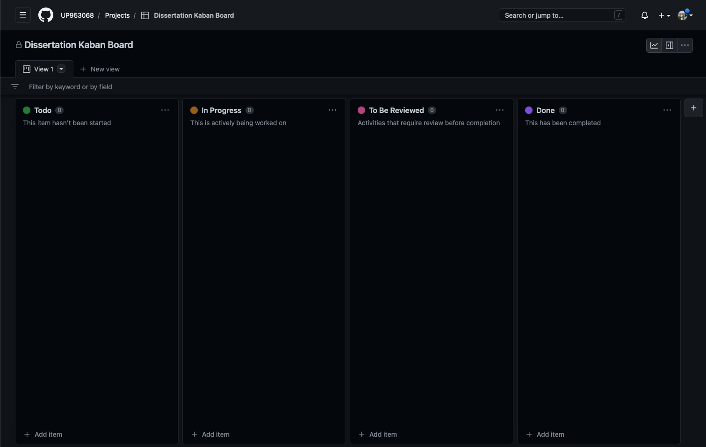

# Design & Project Documentation

## 1 Initial Plan
### 1.1 Problem description
#### What is the problem that should be solved?

What is the best design methodology for a solo software engineer?

Within this project i plan to answer this question via extensive research performed in the literature review.
To test the hypotheses [insert the hypotheses from literature review conclusion] I will build a web application using the methods derived via the research.

The application i propose to build is a health and well being app that provides gym users or people with poor mobility an easy way to view stretches. The app will be based around a 3D human model that allows for the user to click on specific body parts to view specific stretches.

### 1.2 Project application domain

#### Who is our target audience and why?

* Frequent gym users.
  * Those who stretch before & after workout sessions.
  * All age groups who are wanting to relive discomfort when working out.
    * Provides a convenient  way for users to manage their stretches via visual representation.
* People who have existing chronic pain could also benefit from the app
  * Stretches can rescue joint pain and increases flexibility.

Within the United Kingdom over 10% of the population have gym memberships. Within the USA 25%
of young adults aged 18+ are also frequent gym users. This equates to over 70 million people who could be potential users of the app.

#### Medium complexity with 3 distinct components

Our three layers/components:

#### GUI

* To code the GUI of the web application HTML5 will be used along side CSS. The GUI will alow users to interact with the apps logic.

#### Logic

* The Logic component of the application will be coded in Javascript. The use of Jquery and other APIs will also be used.

#### Storage

* Users will be able to create accounts
* SQL data base will be used to store and manage data.
* Authentication will be utilised for users accounts allowing for secure account creation.
  * This will be developed using javascript and the Auth0 API.

### 1.4 Development Team

The development team consists of one member for the needs of the experiment.

#### What are the languages/technologies you are familiar with?

* Javascript
* HTML5
* CSS
* SQL
* Auth0 AUthentication
* Github

#### What languages/tools/technologies will you be using?

* Javascript
  * for the logic and manipulation of the interface.
* HTML5
  * To create the interface.
* CSS
  * To style the interface.
* SQL
  * To store user data and files for the website.
* Auth0 Authentication
  * To allow secure account creation and login pages.
* Web server Hosting
  * USed to host the web-app to the public to use for testing.

### 1.4 Planning

#### Identifying tasks and responsibilities

* Architecture and functionally requirements.
* Initial HTML and CSS wire frame.
  * Make it responsive.
* Code in stretch videos.
* Code in account creation and account page.
* Create backend database.
* Test Application.
* Load Application onto web server.
* Test functionality.
* Gather Feedback.
* Improve based on feedback.
* Final test.
* Launch.

#### Activities planned for the development process

* Software specification (or requirements engineering)
* Software development (design and implementation)
* Software verification and validation
* Software evolution (Software maintenance)
* Software Testing (for bugs and usability)

### 1.5 Logistics

#### How will meetings and communication be carried out within the development team?

* Due to the development team consisting of only one member, frequent meetings will not be required.
  * Instead a task analysis will be performed weekly to ensure the project is on track.
  * Github will be used to store the weekly task analysis via the use of markdown files.
  * If a weekly task analysis for what ever reason can not be performed then it should be adjoined to the following weeks analysis to ensure proper project management.
* A project progression document will also be filled in weekly along side the task analysis.
  * The project progression document will be stored via Github and will also be a markdown file.
* Github will also be used for creating a Kanban board to track all tasks in the project pipeline.

## 2 Product Overview

### Product Title Proposition

* StretchSmart

### 2.2 Product Description

This web application provides targeted stretching exercises for individuals with muscle soreness or limited mobility, aimed at gym-goers and elderly individuals. The 3D human figure interface allows users to select specific muscle groups for appropriate stretches from a range of exercises, tailored to common areas of the body affected by exercise or mobility issues. The user-friendly interface and carefully curated collection of stretches make this application an effective tool for improving flexibility and range of motion.

#### Overall Objective

* Provide a web-based application that offers targeted stretching exercises to relieve muscle soreness and improve mobility.
* Create a user-friendly interface with a 3D human figure that allows users to select specific muscle groups for appropriate stretches.
* Build a library of stretching exercises that are tailored to common areas of the body affected by exercise or mobility issues.
* Include a range of exercises suitable for beginners to advanced users.
* Make the application accessible to a wide range of users, including gym-goers and elderly individuals in need of physiotherapy.
* Ensure the application is responsive and works well on a variety of devices.
* Provide clear and concise instructions for each exercise to ensure users perform them safely and effectively.
* Continuously update and improve the library of stretching exercises based on user feedback and emerging research.

#### Key Features

* Application name: StretchSmart
* The application will run via a website hosted via Github.
* Videos will not be stored locally; They will be fetched from a server when requested.
* Application will fetch all stretch videos relating to the body area, displaying the most relevant first.
* The system will store the user's information within an account, user will be able to login/register using just their email address.
  * The application will store the users past stretches within their account.
  * Account creation will also allow the user to detail why they are using the application and will be recommended stretches based off this information.

```markdown
Software development model: mix of Agile (specifically Kanban) and Lean Software Engineering
  ```

#### Github Project (Kanban) Board

* A Kanban board has been created via a Github project to allow for easy tracking of tasks that are in the development pipeline.



### CW2.3 Need for the system and context of its development

#### Need for the system to be built

All people who go to the gym, weather due to poor form or pushing it too far, will experience some sort of joint/muscle soreness. If left untreated for too long serious injuries could occur that otherwise could have been prevented via appropriate stretches. Most people at the gym often bring their phone for either music or logging excesses, meaning that StretchSmart would be accessible when needed.

The British National Health Service (NHS) provides physiotherapy to people whom require rehabilitation from injuries, or for injury prevention. With the NHS already overwhelmed with backlogged appointments and massive underfunding, [ ] could help put a dent in alleviating strain on the NHS.

*Add More To This Section*

#### Closest competitors/rivals/similar products

In order for SmartStretch to succeed, we must look at the closest competitors that will cause competition to ensure that StrechSmart can have a unique place in the market.

To find competitors, the phrases 'stretch app', 'gym stretch' AND 'Mobility' were placed in the IOS app store search query. The top rated applications with the most reviews were then picked for review. Both the user interface (UI) & user experience (UX) were tested.

After careful review, the closest competitors StretchSmart will face are the following:

| Application Name | Number of Reviews | Rating (out of 5) | UI Rating (out of 5) | Application review | UI |
|---|---|---|---|---|---|
| Bend | 3200 | 4.7* | 4.5 | Bend features a simple yet engaging UI that is satisfying to use. The user, when first using the app, must complete a short exploratory survey so the app can recommend stretches and customise the application around the user. The application doesn't feature a section for muscle recovery however and is more catered to people who partake in Yoga. |    |
| Stretchit | 1400 | 4.6* | 3.5 | Stretchit is aimed at gym users and people who want to increase both mobility and flexibility. The UI is good, but the colour scheme and usability could be better. This application provides videos explaining the movement, similar to our proposition for Stretch Smart. |  
| Pliability | 1000 | 4.8* | 4.5 | Pliability, from the product description and UI, is aimed at gym users and people who require muscle rehabilitation. The UI is easy to use and is would be appealing to their target audience. Their application features a 2D body that users can select initial appears they would like to increase mobility in, however this only appears in the account set up section. |   |
| Yoga | No of review | review average | 4 | Yoga, as the name suggests, is aimed at a niche audience of people who want to start or easily access Yoga. The app is catered to all skill ranges and provides guided videos. Yoga features a very user friendly UI that allows the user to easily access the stretches they would like to perform. One critique i have for the UI is the lack of colour, the theme is very dull and not very engaging. |   |
| Glo | No of reviews | review average | UI review | App review |   |
| GOWOD | No of reviews | review average | UI review | App review |   |

#### How Will StretchSmart Differ From Its Competition?

As mentioned above, StretchSmart has to be unique to compete, especially in todays rapidly evolving app market. One main feature that will differ StretchSmart from the competition is the 3D rotatable body selector. This will allow users to exactly pin point the area where they want to stretch, or feel discomfort.

Two of the competitors within the [competition analysis](#closest-competitorsrivalssimilar-products) featured 2D images for a user to select where they would like to stretch, but both only had limited option and could only be accessed during the applications initiation.

Later on in this document we will perform a requirements analysis to extract all features that StretchSmart should contain. Doing so will provide a clear understanding of requirements for the development stage of the application.

#### Target users

* Gym-goers:
  * This group includes individuals who regularly engage in physical exercise, such as weightlifting, running, or other forms of high-impact training.
  * They may experience muscle soreness or stiffness as a result of their workouts and need targeted stretching exercises to relieve the pain.

* Individuals in need of physiotherapy:
  * This group includes older individuals who may have limited mobility or have experienced injuries that require physiotherapy.
    * They require stretching exercises to improve their range of motion and flexibility, allowing them to perform daily activities with greater ease.
  * This group also includes people who have sustained injuries and want to rebuild mobility and strength.

Application is aimed at both sexes and all ages.

### CW2.4 Process used for eliciting requirements

#### Methods to elicit the requirements

* To elicit the requirements, first brain storming was used to formulate the ideal features for the application.
* From this brain storm, the key requirements were whittled down to the following:
  * Users should be able to easily access the application via the use of a web-application.
  * Users should be able to view videos of stretches with clear instructions on how to perform them.
  * Users should be able to create accounts to log their stretch progression along with the number of stretches they have completed.
  * User should be able to select problematic body part.
    * They should then do a short 'exploration survey' find out what exactly the problem areas are.
  * Ability for users to rate stretch videos based on their experience partaking in them.

* Another method used to elicit requirements was during the [competitor analysis](#closest-competitorsrivalssimilar-products). Performing this analysis detailed how stretchSmart had to be unique to compete in the stretch app market.

* These requirements will be included in a google form for initial requirement gathering and will be provided to potential users to comment on the requirements and provide comments and insight.
  * *Google Forms has been chosen to carry out requirement research as neat, preloaded graphs are generated that collate all data collected. This makes reviewing feedback quicker to analyse.*
  * *Only the participants age will be collected during this survey. If the user wishes to review and test the application once developed then they can provide their email address at the end of the survey if they wish.*
    * *All participant data will be kept secure and shall not be shared with anyone other than the members of this project. All data will be kept on a secure, password protected device that can only be accessed by Jamie Doe*
  * The overall purpose of the survey is to gather what features should take priority over others in order to elicit the correct requirements from our target audience.
    * A mix of closed and open ended questions are included in the survey.
    * Survey should take around 5 minutes to complete.
  * It will also provide us relevant information about our target audience that can help with development.
  * All of the data gathered from the survey will make development of StretchSmart smoother as there will be fewer questions that arise surrounding exact requirements.
* The survey contains a consent form at the beginning, whereby the user can simply exit the browser window if they do not wish to proceed.
* This is a link to the [Google Form](link)

#### Challenges faced during the eliciting requirements period


```markdown
* There were a few challenges faced during different phases of the elicitation period. One of them being the availablity of the stakeholders to conduct the interview, which we eventually overcame.
Other challenges faced include:
  * Getting stakeholders to agree on features during the brainstorm process.
  * Understanding the user journey expected during the interview stage.
  * Formulating effective questions to ask to both users and the stakeholders concurrently during the survey and interview processes.
```

#### Results obtained during the eliciting requirements period

* The data collected from the interviews is displayed below:

```markdown
{width=400px}

* The survey results provided more accurate data with 40 recorded responses, it provided us with further evidence of which features are most important to the user. The results also
provided us with useful information regarding peak system usage times and what devices the users are likely to access the system on. Please see below results:


* An interesting answer to a question asking the user to elaborate on their most important features:
  * It highlights the UK Food Information Amendment, otherwise known as Natasha's law. Which is a new law added on October 1st 2021 regarding allergens, this should be taken into
  account when prioritising requirements.

{width=400px}
```

#### Results analysis

```markdown
* Data has been analysed by collecting the results from the surveys and interviews and comparing the statistics via an excel spreadsheet
* Some patterns have been identified through observation of the data.
  * One of the patterns highlights the importance of the creating an account feature, stakeholders rated account creation as the most important feature (interview results for question 2).
  * Furthermore, the user survey showed that 80% of users (figure 9) would like to log past meals for future use, which would require an account.
  * In addition to this, 90% of users would be willing to create an account in order to gain this personalised feature (survey figure 8).

* Another set of patterns - in specifically, the user survey data - has allowed us to identify the most likely scenario in which the system will be used.
  * 65% of users (survey figure 5) indicated that they would use the system in the evenings.
  * 65% of users are likely to use the system with an internet connection
  * 80% of the users are likely to use the app no their mobile phone. Using these stats, we can predict peak usage time of the system and build a scenario, whereby the user is most likely going to be using the system in the evening on their phone and will use the internet and will therefore be putting most load on the system in the evenings.

* Data shows that almost all users want clear cooking instructions and allergy information for suggested recipes. This is displayed where:
  * 97.4% (survey figure 11) of users were in favour of cooking instructions.
  * 94.9% of users being in favour of allergy detection notifications (survey figure 12).
  * 55% of users voted in favour of inputting or displaying allergy information during the input process.
* Combining the 3 sets of data and the result returned, whereby 95% of the users agreed there is a need for the app.
* It is an accurate assumption that there is a need for the system, particularly when cooking instructions are included and allergens are displayed to the user.
```

### CW2.5 Final User requirements

| User Requirement | Functional/Non-functional | Source |
|---|---|---|
| The user should be able to easily select required body part | Functional |  |
|  | | |
| The user should be notified when an ingredient is about to expire or has expired.| Functional | User survey figure 9 and figure 10 data.|
| The user should be able to create their own personal account | Functional | Interview question 3 data, survey figure 8 and 9 data.|
| The user should be able to log past meals | Functional | User survey figure 9 data.|
| The user should be recommended recipes based on user search history | Functional | User survey figure 9 data|
| Popular recipes should be displayed to the user | Functional | User survey figure 9 data |
| There should be little personal data taken from the user | Non-functional | Interview data (question 3) |
| The system should have a user friendly design | Non-functional | Interview data (question 3) |
| The system should be able adapt to different screen sizes and resolutions | Non-functional | Interview data (question 3) |
| The system should operate with high effiency and speed | Non-functional | Interview data (question 3)|
| The system should be secure | Non-functional | Interview data (question 3)  |
| The system should be accessible to a range of users | Non-functional | Advocated within laws (Disability Discrimination Act, 1995 and Equality Act,2010) |

<!-- source of each user requirement is referenced back to the data collected via the requirements gathering process. -->

### CW2.6 Functional requirements analysis

| Functional Requirements | System Requirements |
|:---| :-------|
| Input system and search engine | All users must be able to select or input ingredients. Users are required to select at least 3 ingredients and no more than 15 ingredients. |
| Allergen notifications | The system must identify allergies based on the user's data on any allergies they may have. The system must alert the user when a recipe option contains an ingredient the user is allergic to. All users must be able to enter/change allergen information and receive notifications. |
| Expiry-date reminder | The system must be able to save the expiry date of each ingredient the user has. The system must be able to use this data to send reminders to the user when an ingredient is approaching its expiry date (2 days before, 1 day before and, on the day).
| Account creation | Users will be able to create an account using auth0 platform. The account creation requires a user email address.|
| Meal history | The system must show the past and saved meals only if a user is logged in|
| Recipe recommendations | The system must be able to show the recipe recommendations based on the recipe chosen by the user|
| Output system | The system must respond to the user's attempt to search for matching recipes within 5 seconds. The user must be able to view and select a recipe from the recipes returned from their inputted ingredients.
| Display | The user must be able to see the home page of the application within 5 seconds of loading the web application. At all times after that, the user must have a display (view) of the application on their electronic device.
| Authorization | The system shall allow access to saved and past recipes only to the user who has an account and is authorized. |

### CW2.7 Non-functional requirements

1. **Navigation & Usability:**
The UI for StretchSmart should be easy to learn and similar to how other platforms are operated, this will hopefully mean the user is already familiar with the navigation of the application. Stretch~Smart's UI will be structured in a way that makes using the application as accessible as possible to all users with clear paths that the user should take.
SmartStretch's ease of use will be tested via getting users from a wide range of age groups, and different use cases to test out the application, in order see how comfortable they feel navigating then UI.

2. **Accessibility for *All Users*:**
StretchSmart is an all-inclusive app meaning we aim to cater to all technical & physical abilities. This requirement is also a legislative requirement that will be followed. Within StretchSmarts 'Preferences' menu, there will be accessability features such as user adjustable 'Dark Mode' and language options. This allows users to cater StretchSmart to their preferences, giving the user a sense of control of the application, providing a better User Experience(UX).

3. **Performance:**
An application should load as fast as possible, the ideal application load time should be 1-2 seconds. A recent study by Shaun Anderson (over 20 years experience in SEO and web-dev) found that 53% of mobile users abandon a website if it takes more than 3 seconds to load. Due to this it is important that SmartStretch maintains performance levels adequate to retain user engagement.
Unfortunately, as stated in the later [System properties & constraints](#system-properties--constraints) section, performance will partly be dependant on a users network stability.

1. **Security:**
The security of user data is the most important requirement StretchSmart will abide by. To ensure that user information is secure, third party authentication via Auth0 will be utilised. This means that the users passwords are not stored locally and are encrypted via google authentication. This process also eliminates the possibility of a 'robot' user, further securing website against malicious attacks.
All SQL queries will also be sanitised to ensure attacks of the database aren't possible. The application will operate with HTTPS encryption, adding another layer of security between server and application.

#### Organisational requirements

1. Storing only necessary data:
We aim to ensure that we only take necessary user information and ensure we follow all legal policies in regard to data collection and storage.

2. Data extraction:
We will only ask the user for their email address, all other user infromation will be taken via external authentication service (Auth0). This method of account creation will grantee security of user data.

3. Legislation
We will ensure SmartStretch is in guidance with the [world wide web consortiums](https://www.w3.org/standards/) standards, and follows strictly with regulations such as the [data protection](https://www.legislation.gov.uk/ukpga/2018/12/contents/enacted), [discrimination and accessibility](https://www.gov.uk/guidance/accessibility-requirements-for-public-sector-websites-and-apps#why-making-your-public-sector-website-or-mobile-app-accessible-is-important) acts

#### External requirements

1. **Bandwidth Coverage**:
SmartStretch will require a network connection either via WI-FI or cellular due to being a web-application. Therefore, an assumption has been made that all users will have access to the internet when using SmartStretch.
Network tests will be performed during the application test stage to see how SmartStretch will perform on high and low speed networks.

2. **Responsiveness**:
System will handle external interruptions efficiently and will return to the last viewed state when the user returns. If an interruption causes the application to fail then the user should be greeted with an error message explaining the issue.

3. **Authentication Service**
Due to the account authentication being external to the application, if Auth0 was to have a server outage then users would not be able to login to or have access to their accounts temporarily. This would be an inconvenience to the user, but it is a small price to pay for secure user data. During such an instance, the user will be greeted with a message in their account page detailing the issue.

#### System properties & constraints

* The backend database must have enough storage to store not only the stretch videos, but also for the user info collected, such as 'Stretch progression' and 'Completed Stretches'.
* Response time should be between 1 - 2 seconds as this is the standard response time for web pages. Any longer and a portion of users will begin to think the page isn't loading and leave.
* User networks might bottle neck the application leading to longer than usual loading times. This is a constraint that is out of our control, but we can try to mitigate this issue via other means of data processing such as asynchronous functions to allow for parallel processing when requesting from servers.

| Non - Functional Requirements |  System requirements |
|:---| :-------|
| **Usability** | The system should be easy to navigate and should be easy to pick up and learn the interactions of the system. It should require no extra time to learn the system.|
| **Accessibility** | The system should be accessible to **all** our users and cater to a range of abilities. |
| **Performance** | The system should not take more than 1 - 2 seconds to load the initial screen, As this is the standard loading time. We will test this via loading our app and ensuring it takes between 1 - 2 seconds. We also note that network connection could play a factor in performance. |
| **Reliability** | The system shall provide appropriate error handling when a user has inputed less ingredients than required (i.e two ingredients). |
| **Screen adaption** | The system shall adapt to the screen size depending on the device, the application will render it's layout according to the device and will cater to different screen sizes and automatically adjust to font size. |
| **Compatibility** | The system shall be compatible on all devices including tablets, phones and desktops. The application will work on all IOS and Android Operating Systems. |
| **Security** | We will ensure it is HTTPS secure using github pages. The system will have a secure login that complies with NCSC (NCSC, n.d.). The system will also comply with  NIST authentication guidelines (NIST, n.d.). |
| **Legislation** | The system will ensure it is in guidance with the world wide web consortiums standards (W3C, n.d.) and regulations such as the data protection act (DPA, 2018), discrimination and accessibility (Equality Act,2010). |
| **Amount of data taken from the user** | The system will use auth0 to minimise data taken from the user. Auth0 will use an email address to authenticate a user |
| **Network Coverage** | The system will only function when the user is connected to internet. |
| **A Responsive application** | System shall handle external interruptions (such as a phone call) efficiently and will return to the last viewed state when the user returns. |

#### UI design

The design process employed a sequential approach that involved utilising various design fidelities. Starting with a rough wireframe on paper as the initial low-fidelity design, it served as the foundation for the medium-fidelity design, which provided greater detail. 
The 'high-fidelity' design for SmartStretch's UI was developed using Figma, a potent visualisation tool that facilitates the creation of production-ready app interfaces, including animations and load delays.

The following is the low-fidelity design that was sketched out on paper. This design serves as a wire-frame for the medium-fidelity design process.


The following is the medium-fidelity design that was created using basic Photoshop shapes and free for use images. This design serves as a wire-frame for the final high-fidelity design.


The following renders are High-fidelity replicating what the finished product will look like:


